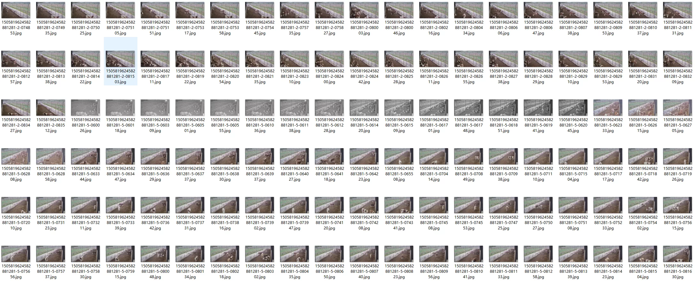
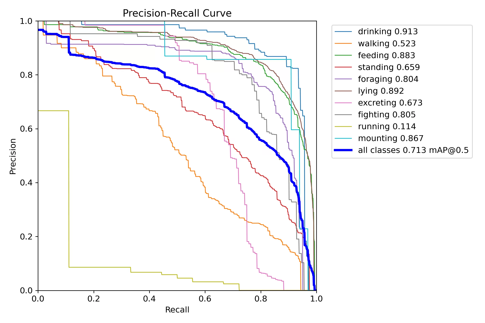
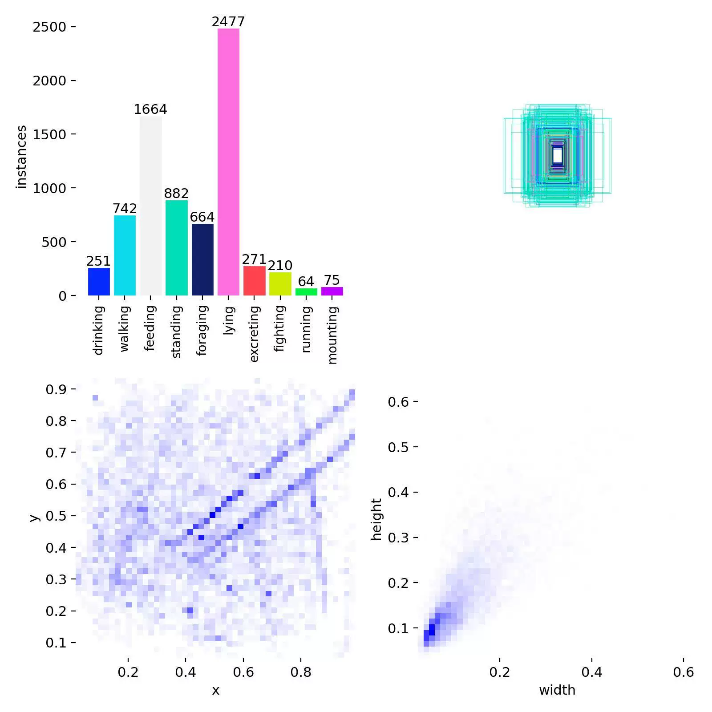
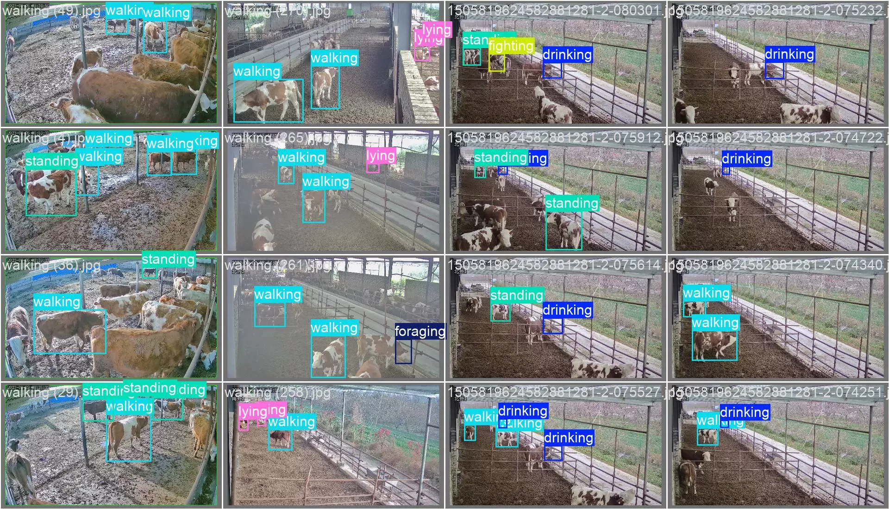
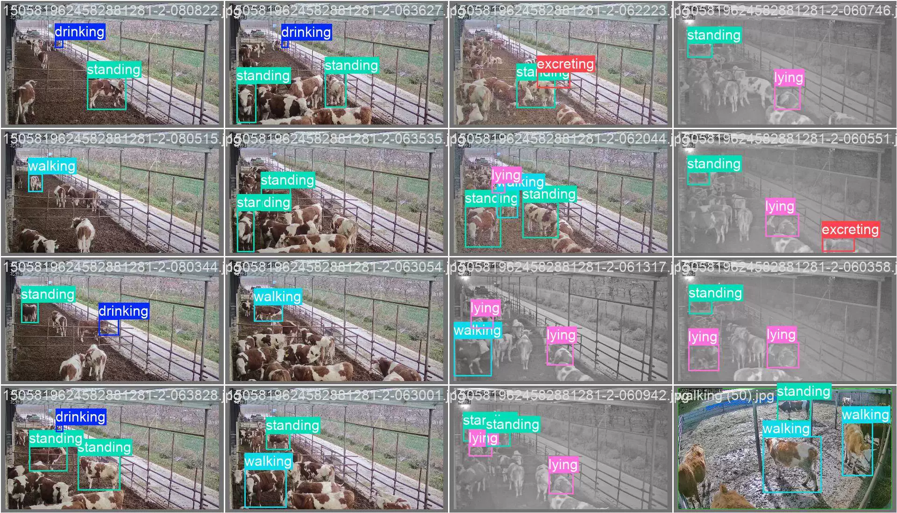
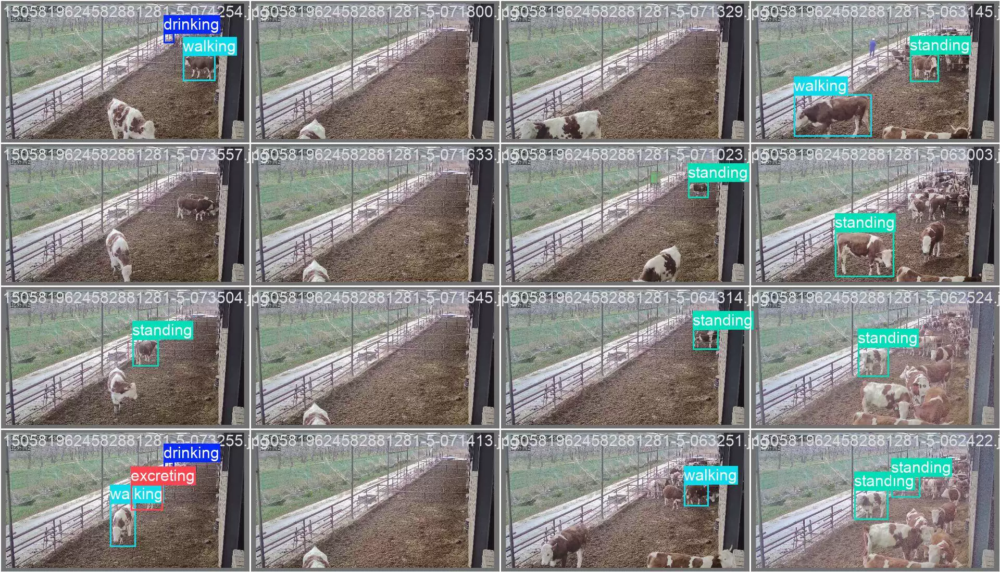
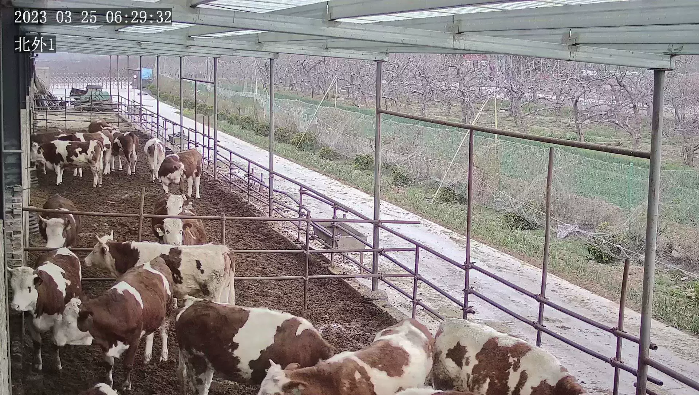
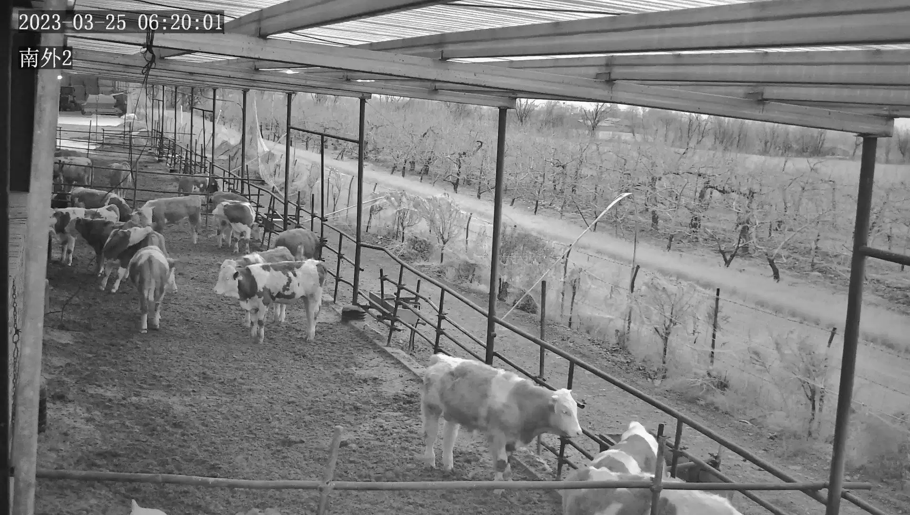

## Body

The dataset for西门塔尔牛 multi-object behavior determination is derived from a real farm environment, covering different seasons, lighting, and indoor/outdoor scenes. It consists of 3218 images, with annotations for 10 types of behaviors including lying down, standing, walking, running, eating, foraging, drinking, defecating, fighting, and mounting, totaling 11318 instances. We have adopted a semi-automatic process of "automatic pre-labeling + manual verification" to ensure the quality and efficiency of the annotations. The dataset is provided in PASCAL VOC and YOLO formatted annotation files.

There are 3218 images in total, each labeled separately. The YOLO format has been divided into train (2,047), valid (877), and test (294) categories.

The dataset is divided into 10 classes: drinking, walking, feeding, standing foraging, lying, excreting, fighting, running, mounting.

YOLOv8s target detection weights file (Training rounds 100, pre-trained model YOLOv8s.pt, mAP@0.5 0.713) with training results file
YOLOv8m target detection weights file (Training rounds 100, pre-trained model YOLOv8m.pt, mAP@0.5 0.7166) with training results file

## Images

item_1064771196212

Here is a pay link on Stripe ( https://buy.stripe.com/3cs8yP7sY87d0vu9AB ). Please contact me lonlonago@foxmail.com after funding $89, and I will send you a complete data files , thank you!

